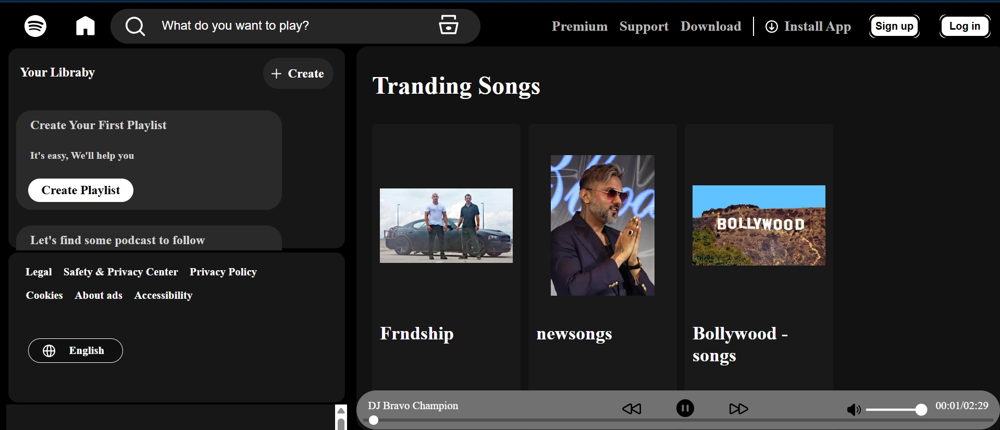
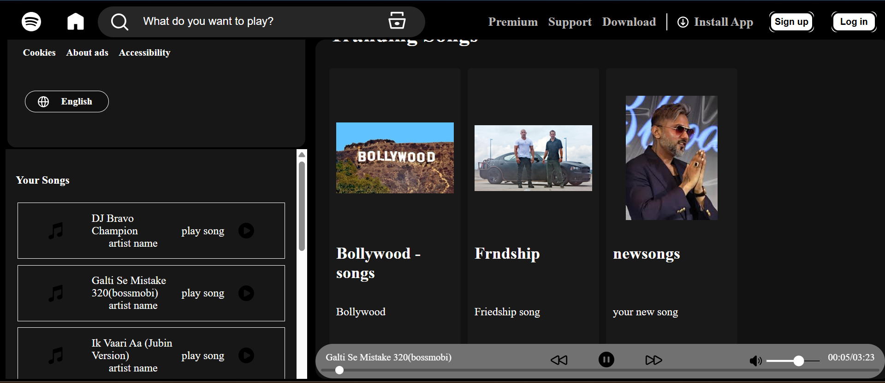
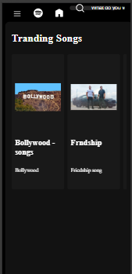
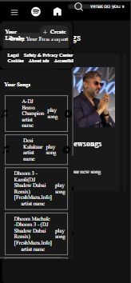

# SpotWave — Modern Music Player Web App 🎵

[](https://developer.mozilla.org/en-US/docs/Web/JavaScript)
[](https://developer.mozilla.org/en-US/docs/Web/CSS)
[](https://developer.mozilla.org/en-US/docs/Web/HTML)
[](https://opensource.org/licenses/MIT)

SpotWave is a high-fidelity, client-side music streaming replica inspired by Spotify's design language. Built strictly with vanilla web technologies, this project demonstrates advanced DOM manipulation, precise asynchronous audio state handling, and pixel-perfect responsive layouts without the overhead of heavy frameworks.

🚀 **[View Live Demo](PASTE_YOUR_GITHUB_PAGES_LINK_HERE)**

---

## ⚡ Core Features

* **Advanced Audio Controls:** Continuous track playback, dynamic seek/progress bar synchronization, volume scaling, and seamless shuffling/looping mechanisms.
* **State-Driven UI:** UI elements (play/pause toggles, active track highlights, dynamic timers) sync instantly with the native HTML5 Audio lifecycle.
* **Component-Driven Layouts:** Engineered using a mobile-first approach with CSS Grid and Flexbox to guarantee fluid responsiveness across ultra-wide monitors, tablets, and mobile displays.
* **Optimized Assets:** Lean image loading and optimized audio buffering strategies for instantaneous interaction.

---

## 🎨 Interface Preview

| Desktop View | 

|  |
|  |

| Mobile View |

|  |  |

> *💡 Tip: Replace these placeholder images with actual screenshots or a high-quality GIF of your application once pushed!*

---

## 🛠️ Architecture & Technical Focus

### Tech Stack
* **Markup:** Semantic HTML5 for robust accessibility (a11y) and SEO structures.
* **Styling:** Vanilla CSS3 utilizing custom properties (CSS variables) for streamlined theme management and modular layout scaling.
* **Scripting:** Modern JavaScript (ES6+) leveraging modular event listeners and clean functional state management.

### Engineering Highlights
* **Zero Dependencies:** Engineered completely from scratch to maximize raw browser performance and deep-dive into vanilla API behaviors.
* **Event Delegation:** Optimized UI event listeners to keep the main execution thread light and performance metrics high.

---

## ⚙️ Getting Started

To run this project locally, simply clone the repository and launch it using a local server (like the VS Code *Live Server* extension).

```bash
# Clone the repository
git clone [https://github.com/YOUR_USERNAME/spotwave-music-player.git](https://github.com/YOUR_USERNAME/spotwave-music-player.git)

# Navigate into the project directory
cd spotwave-music-player
